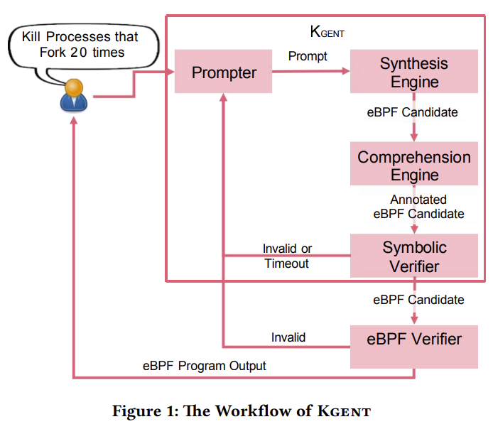

# 简化内核编程：LLM驱动的eBPF工具

内核编程通常需要深入了解操作系统内部结构和编程约束，因而令人生畏。我们的新工具Kgent旨在简化这一过程，使创建扩展的Berkeley Packet Filter（eBPF）程序变得更加容易。Kgent利用大语言模型（LLM）的强大功能，将自然语言提示转换为eBPF代码，从而降低内核编程的门槛。

我们的论文《[Kgent：内核扩展的大语言模型代理](https://dl.acm.org/doi/10.1145/3672197.3673434)》最近在eBPF '24：ACM SIGCOMM 2024 eBPF和内核扩展研讨会上发表。让我们深入了解Kgent为何能成为内核编程的变革者。
<!-- more -->

## Kgent的核心理念

Kgent通过将用户的自然语言提示转化为eBPF代码，简化了传统上复杂的eBPF编写过程。它结合了程序理解、符号执行和反馈循环，以确保生成的程序准确无误并符合用户意图。

## 主要特点

- **自然语言到eBPF**：Kgent可以将用户的英语提示转换为功能性的eBPF程序。
- **多种技术结合**：它采用程序理解、符号执行和反馈循环的组合，以确保高准确性。
- **评估结果**：测试表明，Kgent在生成正确的eBPF程序方面比GPT-4提高了2.67倍，具有高准确率和最低的误报率。

## 适用场景

Kgent可以在多种场景中帮助简化内核开发和管理：

1. **系统管理员**：帮助初级系统管理员创建和维护eBPF程序，无需深入的操作系统内核知识。
2. **DevOps人员**：协助编写和部署用于监控和跟踪应用程序的内核扩展，提升系统性能和安全性。
3. **补丁开发者**：通过将问题和修复的自然语言描述转化为eBPF程序，简化补丁的创建过程。
4. **内核开发人员**：加速内核扩展的原型设计和验证，节省时间并减少错误。
5. **教育用途**：作为学生和新开发人员学习eBPF编程的辅助工具，通过自然语言交互进行学习。
6. **研究与实验**：为研究人员提供一个平台，让他们可以探索新的eBPF应用并测试假设，而无需深入复杂的编码。
7. **网络工具开发**：通过将高级需求转化为高效的eBPF程序，简化自定义网络监控、安全和性能分析工具的创建。

## 为什么选择Kgent而不是直接使用GPT？

虽然像GPT-4这样的LLM可以建议代码，但它们经常推荐错误的帮助函数或不存在的API，这种现象被称为幻觉。由于eBPF中的帮助函数和kfuncs数量有限，这些问题可以相对容易地解决。另一个常见问题是错误的附加点。在eBPF中，程序必须附加到特定的内核事件，例如kprobes、tracepoints和perf事件。错误的附加事件可能会被内核拒绝，或者更糟糕的是，通过验证器并错误加载，导致错误结果。

eBPF验证器增加了另一层复杂性。例如，由于安全检查，循环代码通常无法通过验证器。虽然验证器可以防止有害代码，但它不能总是防止错误代码。例如，当要求编写一个程序来跟踪TCP连接事件时，GPT-4生成的代码无法正确读取端口号并且没有考虑IPv6。

为了帮助LLM学习eBPF等新知识，常见的方法包括微调或检索增强生成（RAG）。然而，公开可用的eBPF示例不足，并且eBPF功能可能会随内核版本变化。RAG是一种有前途的解决方案，因为它允许模型从外部来源检索最新且相关的信息。这种方法将语言模型生成与从向量数据库中检索相关信息相结合。

## LLM代理框架

为了解决这些问题，我们构建了一个具有三个核心组件的LLM代理：计划、工具和记忆。

**计划组件**
代理遵循预定义的工作流程：

1. **提示器**：根据用户输入检索相关示例、附加点和规格。
2. **综合引擎**：从提示中创建eBPF候选程序。
3. **理解引擎**：注释eBPF候选程序，添加必要的假设和断言以进行验证。
4. **符号验证器**：验证候选程序的行为。如果无效，过程将迭代，直到生成有效的程序，形成反馈循环。
对于某些情况，它还可以使用ReAct模式进行决策。

**工具组件**
代理可以使用各种工具，例如clang编译eBPF程序，Seahorn进行验证，以及bpftrace获取附加点并运行eBPF程序。

**记忆组件**
代理使用短期的上下文记忆来记住过去的操作、错误和决策，确保反馈循环成功。

**示例工作流程**
让我们以一个简单的bpftrace程序为例。假设用户请求：“跟踪tcp_connect事件以捕捉IPv4和IPv6连接尝试，并显示源和目标IP地址。”代理基于预定义的模板形成一个提示，并要求LLM生成程序。我们使用上下文学习和少样本技术，包括在模板上下文中的示例。示例向量数据库包含BCC、bpftrace和我们自己的集合中的示例。代理根据用户输入搜索相似示例，并在提示中包含这些示例。

我们还构建了一个管道，用于从内核源代码生成每个挂钩点和帮助函数的规格和描述。例如，在构建规格数据库时，我们使用LLM生成内核中tcp_connect_init函数的规格。在综合步骤中，代理可以根据用户输入在向量数据库中搜索相关的函数规格。

## 限制和未来工作

虽然Kgent是向前迈出的重要一步，但它也有一些限制。目前，我们的实现专注于小于100行的小程序，这是由于LLM的上下文窗口限制。此外，我们的eBPF程序数据集相对较小，这限制了工具处理更复杂和多样任务的能力。目前，Kgent的用例主要限于简单的跟踪程序和网络功能。

我们正在探索扩展Kgent功能的方法。例如，我们知道像ChatGPT这样的工具可以使用其Python代码解释器处理许多任务。这带来了令人兴奋的可能性：我们能否自动化更大的任务，如自动监控和自动性能调优？LLM能否帮助分析来自不同工具的结果，甚至自动找到这些工具？它能否在快速开发紧急问题的解决方案中发挥作用？

为了解决这些挑战，我们正在考虑将更大的任务拆分为更小的可管理部分，类似于AutoGPT使用的方法。这将允许LLM计划程序的总体结构，生成每个组件，然后将它们合并在一起。此外，让用户参与迭代过程可以提供互动反馈，改进生成程序的质量。

我们还认识到，为LLM编写正确的Hoare合同具有挑战性，当前的验证方法可能无法涵盖生成的eBPF程序的所有行为。为改进这一点，我们需要更好的背景描述和更强大的Hoare表达式。结合更多的软件工程实践，例如反例生成和测试驱动开发，可以帮助确保全面的验证。

另一个关键问题是安全性。由于eBPF在内核中运行，任何缺陷都可能导致重大问题。我们计划让用户更多地参与审查过程，以降低这些风险并确保生成程序的安全性。

## 结论

Kgent通过将eBPF程序创建变得更容易接近来革新我们处理内核编程的方式。通过将自然语言翻译成功能性eBPF代码，它使内核扩展开发对系统管理员、DevOps人员、补丁制作人员等更为开放。我们在eBPF '24上发表的论文强调了该工具的潜力，能够民主化内核编程并推动创新。

我们邀请您探索Kgent，看看它如何改变您对内核开发的看法。有关更多详细信息，请查看我们的[eBPF'24论文](https://dl.acm.org/doi/10.1145/3672197.3673434)并访问我们的[GitHub仓库](https://github.com/eunomia-bpf/KEN)。有关更多可用和简化的工具，请查看[GPTtrace](https://github.com/eunomia-bpf/GPTtrace)。您还可以尝试GPTtrace简化版的[网络演示](https://github.com/eunomia-bpf/GPTtrace-web)。

通过降低编写eBPF程序的门槛，Kgent正在推动创新并增强系统功能，每一次自然语言提示。